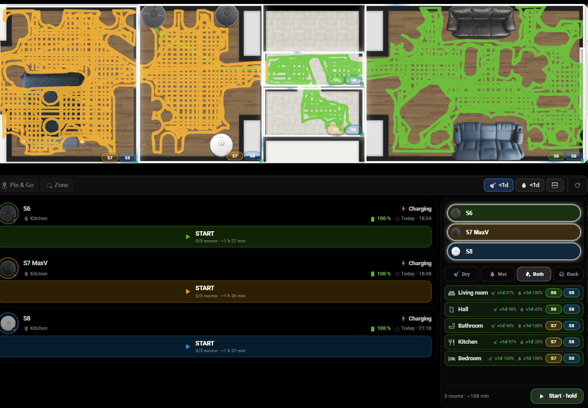
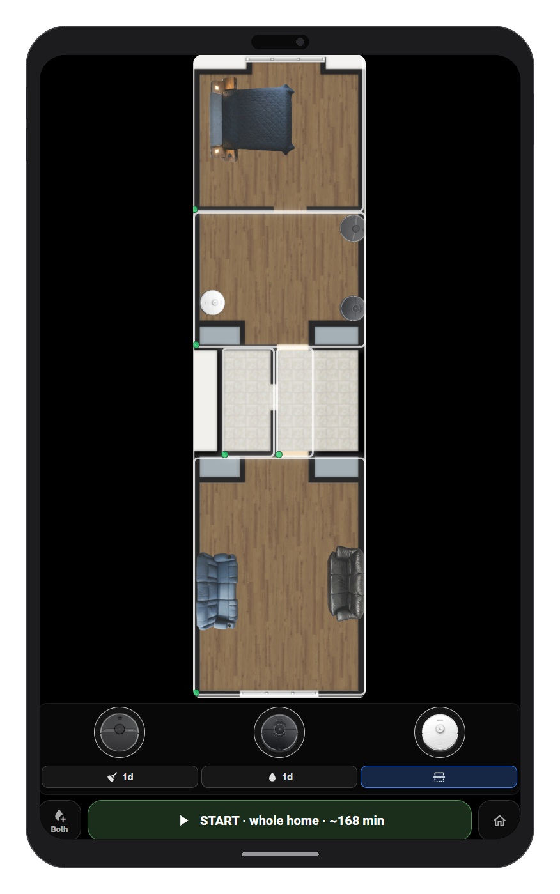
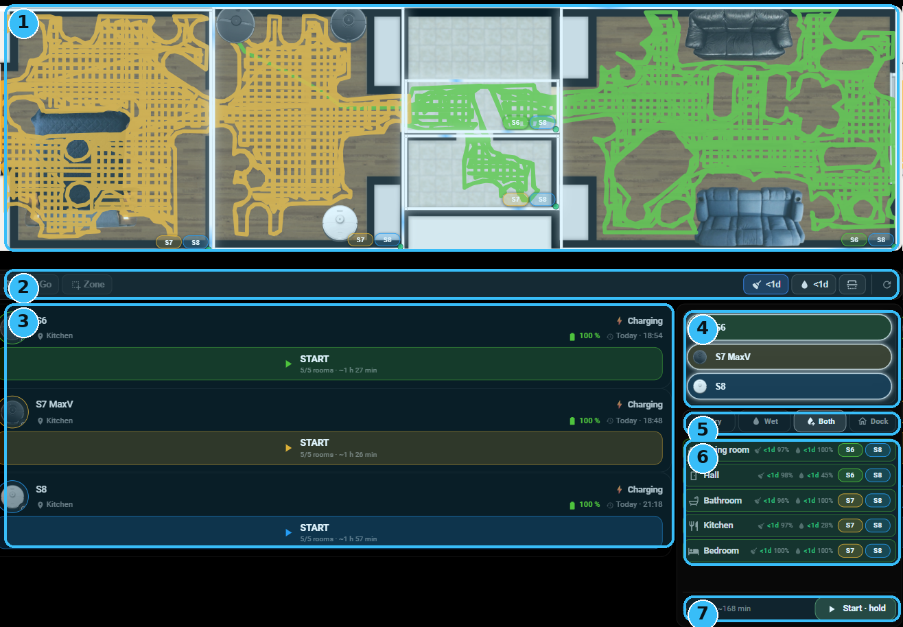
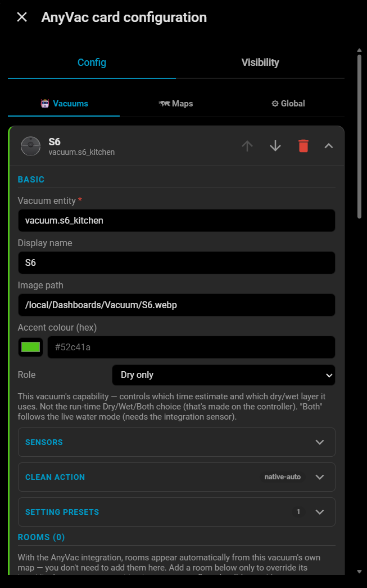
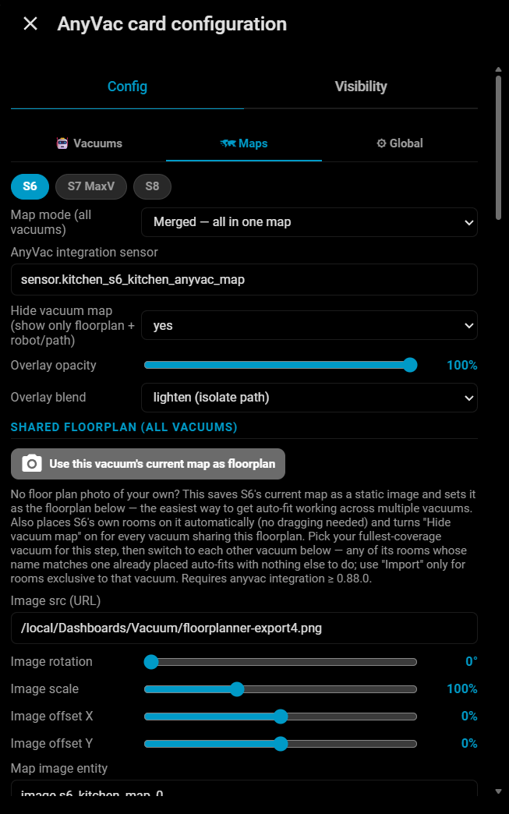
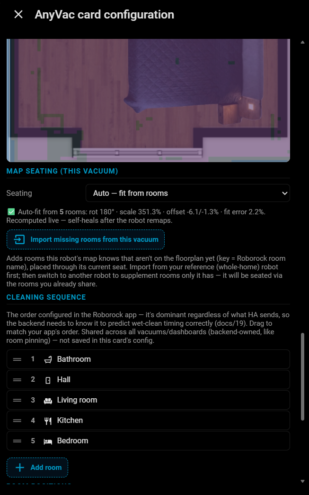
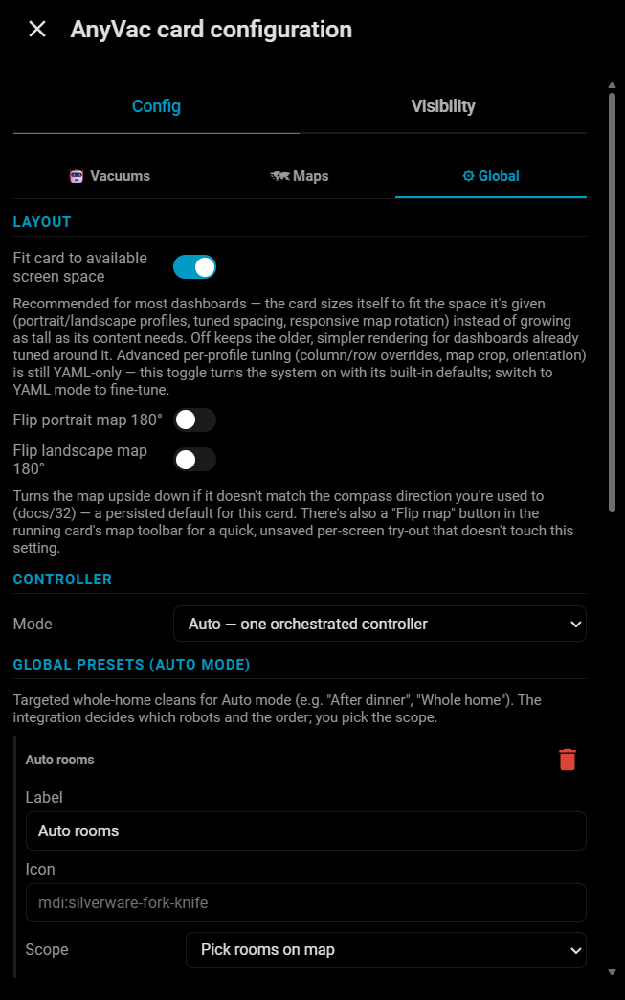

# AnyVac Card

A modern Lovelace card for robot vacuums in Home Assistant. Pick **where** to
clean, not **how**: tap rooms on your own floorplan (or the vacuum's own map)
and start a clean — one robot or several, dry, wet, or both — in a couple of
taps. No pixel↔millimetre calibration, no YAML required for the common case.

Built and field-tested against **Roborock** (via the official integration).
The goal is to work with any vacuum that exposes a standard `vacuum.*`
entity — other vendors run in the card's degraded mode today (manual room
setup, no learned timing) until someone puts in the same field-testing time
on their hardware. Valetudo-based vacuums are a natural next target (MQTT,
no official integration to conflict with).

## Screenshots

**Landscape** — three vacuums sharing one floorplan, live dry/wet paths, room
assignment chips, coverage % and last-cleaned age per room:



**Portrait** (phone) — the same setup, map on top, vacuum picker, mode
switch, one-tap start bar:



### Landscape layout, region by region



| # | Region | What it does |
|---|---|---|
| 1 | **Map** | The shared floorplan (or the vacuum's own map in split mode), with live robot position and dry/wet cleaning paths colour-coded per vacuum. Tap a room to select it — this is the only way to pick specific rooms, on this or any other region. The small avatar chip in a room's corner shows which vacuum is currently assigned to clean it. |
| 2 | **Meta bar** | Left: **Pin & Go** (tap a point on the map to send a robot straight there) and **Zone** (draw a rectangle to spot-clean an area, draggable/resizable before you confirm). Right: per-layer dry/wet path visibility toggles and a manual refresh button — an amber warning icon can also appear here for unassigned or unsequenced rooms (see Troubleshooting below). |
| 3 | **Status cards** | One card per vacuum — current state and room, battery, when it last charged, and its own **START**, showing that vacuum's own room selection and ETA. This is where you monitor an individual robot, and in `ui_mode: manual` it's the primary way to start each robot independently on its own presets. |
| 4 | **Vacuum picker** | One pill per vacuum. Hold a pill to show/hide that vacuum on the merged map — handy with 3+ robots sharing one floorplan when the overlapping paths get busy. |
| 5 | **Mode row** | The **Dry / Wet / Both** pass selector for the orchestrated clean, plus **Dock**, which opens the dock sheet (Empty / Wash / Dry / Pump / Self-clean, plus consumable levels — see the Global tab walkthrough below). |
| 6 | **Room list** | One row per room: dry/wet last-cleaned age, learned coverage %, and avatar chips showing the assigned vacuum for each pass. Tap an avatar to cycle or pin a specific robot to that room; rows are tap targets too, equivalent to tapping the room on the map. |
| 7 | **Footer** | A running summary of the current selection (room count and estimated time) and the orchestrated **Start · hold** button — hold to confirm, same gesture as the portrait start bar. |

The portrait layout (screenshot above) carries the same seven ideas, just
stacked into a single column and reachable with one thumb: map on top, then
the vacuum icon strip (equivalent to the picker), the mode row, and the start
bar at the very bottom.

## What it's built around

- **Pick where, not how.** Rooms are tap targets on the map. Cleaning
  *style* (suction, mop intensity, repeats) lives in named presets you set up
  once per vacuum — you're never filling in a settings form before you can
  start a clean.
- **Your own floorplan.** Use a photo or scaled drawing of your home instead
  of the vacuum's own (often distorted, hard-to-read) SLAM map as the visual
  backdrop. Multiple vacuums' maps and rooms line up on it automatically.
- **Multi-vacuum orchestration.** One controller decides which robot cleans
  which room, runs dry passes before wet ones, and dispatches a mop robot to
  finished rooms without waiting for the whole job — you just pick a scope
  and hit start.
- **Learned timing, not guesses.** Per-room clean-time estimates and
  coverage % are learned from your own vacuum's actual cleaning history, not
  a static average.
- **Calibration-free by construction.** Everything is driven by the
  vacuum's own room/segment data — there's no manual "click three corners to
  calibrate" step to get right or to redo after a remap.

## Card + integration: two halves of one thing

This repository is the **card** — it always installs and always shows a
working vacuum controller on its own, driving your vacuum directly through
Home Assistant's standard `vacuum.*` services ("degraded mode"). In that mode
you configure rooms and timings by hand and there's no orchestration, learned
timing, or coverage tracking.

Nearly everything described above — auto-discovered rooms, multi-vacuum
orchestration, learned estimates, coverage %, live map/path — needs the
companion **[`anyvac` integration](https://github.com/Michailjovic/anyvac)**
running alongside the official Roborock integration (it reads from that
integration, it doesn't replace it or open its own robot connection). Install
both to get the experience shown in the screenshots above; the card alone is
a capable but plain remote control.

## Installation

### Card (this repo)

**HACS (recommended):**

1. HACS → **⋮** → **Custom repositories**.
2. Add `https://github.com/Michailjovic/anyvac-card` with category
   **Dashboard**.
3. Install **AnyVac Card** and reload your browser.

**Manual:** copy `dist/anyvac-card.js` to `config/www/` and add it as a
dashboard resource (`/local/anyvac-card.js`, type *JavaScript Module*).

### Integration (optional, but recommended)

Install **[`anyvac`](https://github.com/Michailjovic/anyvac)** the same way
(HACS custom repository, category **Integration**), then add it from
**Settings → Devices & services**. It auto-discovers vacuums from your
existing Roborock integration — nothing to configure.

## Quick start

With the integration installed, this is a complete, working config:

```yaml
type: custom:anyvac-card
layout: {}
vacuums:
  - entity: vacuum.s8_maxv_ultra
```

The map, room list, and per-room timing are all picked up automatically —
nothing else to add. `layout: {}` opts into the card's responsive sizing
(recommended for essentially every dashboard; see the Global tab below to
turn it on from the GUI instead).

More starting points, including multi-vacuum and no-integration setups, are
in [`examples/`](examples/).

## Setting it up from the GUI editor

Add the card (**+ Add card → AnyVac Card**, or paste the YAML above) and
click the card's **Edit** pencil to open the editor. It has three tabs.

### 🤖 Vacuums



One entry per vacuum. Only **Vacuum entity** is required — everything else
here has a working default:

- **Display name / Accent colour** — cosmetic, auto-derived if left blank.
- **Image path** — an optional per-vacuum icon shown on badges/pickers.
- **Role** — this vacuum's cleaning capability (dry-only, wet-only, or
  both). With the integration, this auto-detects from the vacuum's live mop
  sensor if left unset.
- **Sensors / Clean action** — degraded-mode-only. With the integration
  active, all clean commands go through it and these are ignored.
- **Setting presets** — named "how to clean" shortcuts (suction, mop
  intensity, repeats) shown as chips next to the vacuum's Start button.
- **Rooms** — only needed to *override* something (a custom icon, or a
  fixed map position for a room the auto-seating can't place) or, without
  the integration, to define rooms manually from scratch. With the
  integration, rooms already appear automatically from the vacuum's own map.

### 🗺 Maps



- **Map mode** — `Split` (one map per vacuum) or `Merged` (all vacuums on
  one shared map). Single-vacuum setups can leave this on the default.
- **Shared floorplan** — only relevant in Merged mode. Without a floorplan
  image, each vacuum's raw map is drawn independently and they won't line
  up. The **"Use this vacuum's current map as floorplan"** button handles
  this end to end: it snapshots the selected vacuum's own map, crops it to
  its actually-explored area, sets it as the shared floorplan, and places
  that vacuum's rooms on it — no manual file upload, no dragging.
- **Map seating (per vacuum)** — how *this* vacuum's map/rooms line up on
  the shared floorplan. `Auto — fit from rooms` (the default) computes this
  from room name matches against whatever is already placed; pick your
  fullest-coverage vacuum first (via the snapshot button above), then switch
  to each other vacuum and let it auto-fit against the rooms your reference
  vacuum already placed.

> **Merged mode requires matching room names across vacuums.** Auto-seating
> and cross-vacuum orchestration both key off room name — if one robot calls
> a room "Bedroom" and another calls the same physical room "Ložnice" in its
> own Roborock app, the card and integration have no way to know they're the
> same room. Rename rooms to match in each vacuum's own app first.



- **Import missing rooms from this vacuum** — adds rooms this vacuum's map
  knows about that aren't on the floorplan yet, placed via its current seat.
  Use this on any vacuum with rooms exclusive to it (a robot covering an
  extra floor, say) after seating it against the shared reference.
- **Cleaning sequence** — drag to match the room order in the Roborock app.
  The app's own order always wins regardless of what Home Assistant sends,
  so the integration needs to know it to predict wet-clean timing correctly.
  This is shared across all vacuums/dashboards (backend-owned), not saved in
  this card's config.

### ⚙ Global



- **Fit card to available screen space** — recommended for essentially every
  dashboard; turns on the responsive portrait/landscape layout with sensible
  built-in defaults (same as `layout: {}` in YAML). Off keeps the older,
  unconstrained render for dashboards already tuned around it.
- **Flip portrait/landscape map 180°** — if the map doesn't match the
  compass direction you're used to. There's also a quick, unsaved "Flip map"
  button in the running card's map toolbar for a one-off try.
- **Controller mode** — `Auto` (one orchestrated Dry/Wet/Both controller
  across all vacuums — the default, and what multi-vacuum orchestration
  needs) or `Manual` (one independent controller per vacuum, using its own
  presets — no cross-vacuum load-balancing).
- **Global presets** (Auto mode) — named whole-home or scoped shortcuts
  (e.g. "After dinner") beyond the default "tap Start with nothing selected
  = whole home" behaviour.
- **Room appearance / Thresholds** — cosmetic room-icon/border settings and
  the day thresholds that colour a room's last-cleaned-age border.
- **Notifications** — the card doesn't send notifications itself; the
  integration fires events and ships three ready-made automation blueprints
  (Settings → Automations → Create with blueprint) for clean-finished,
  vacuum-error, and room-overdue alerts.

Every field above — including the ones this walkthrough skipped — is
documented in **[`CONFIGURATION.md`](CONFIGURATION.md)**, with its exact
type and whether it needs the integration, applies only in merged mode, etc.

## Troubleshooting

- **Yellow "degraded mode" banner.** The card can't confirm the `anyvac`
  integration is active for this vacuum (not installed, not yet polled
  once, or an old version). Check **Settings → Devices & services → AnyVac**.
- **No map at all.** In degraded mode, the map image entity isn't
  auto-detected — set it explicitly on the Vacuums tab (**Sensors → Map
  image entity**). With the integration, this should never be needed; if it
  is, the vacuum's `image.*` entity may be unavailable.
- **Vacuum maps overlap unaligned in Merged mode.** No shared floorplan is
  set — see "Shared floorplan" above.
- **A vacuum's rooms cluster in the wrong spot on the shared floorplan.**
  Its room names don't match the reference vacuum's — see the callout under
  the Maps tab above.
- **An amber warning icon next to a room or the ETA.** "Unsequenced" means
  that room has no position in the Roborock app's cleaning order yet (drag
  it into place on the Maps tab); "unassigned" means the current plan
  couldn't find a capable vacuum for it (check Role on the Vacuums tab).
- **Pin & Go / Zone tools greyed out.** These are disabled while the map is
  shown rotated (portrait, or a tall/narrow floorplan in landscape) — the
  click-to-coordinate math doesn't support it yet.

Still stuck? Open an issue with your config (redact entity IDs if you like)
and a screenshot.

## Also see

- **[`CONFIGURATION.md`](CONFIGURATION.md)** — every config key, its type,
  default, and where it applies.
- **[`examples/`](examples/)** — copy-paste starting configs (minimal
  single-vacuum, merged multi-vacuum, manual mode with presets, degraded
  mode).
- **[`CHANGELOG.md`](CHANGELOG.md)** — version history.
- **[`anyvac` integration](https://github.com/Michailjovic/anyvac)** — the
  companion backend.

## License

MIT.
